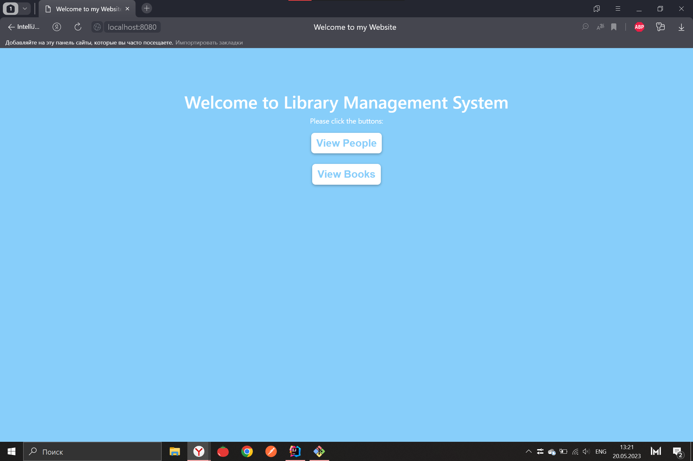
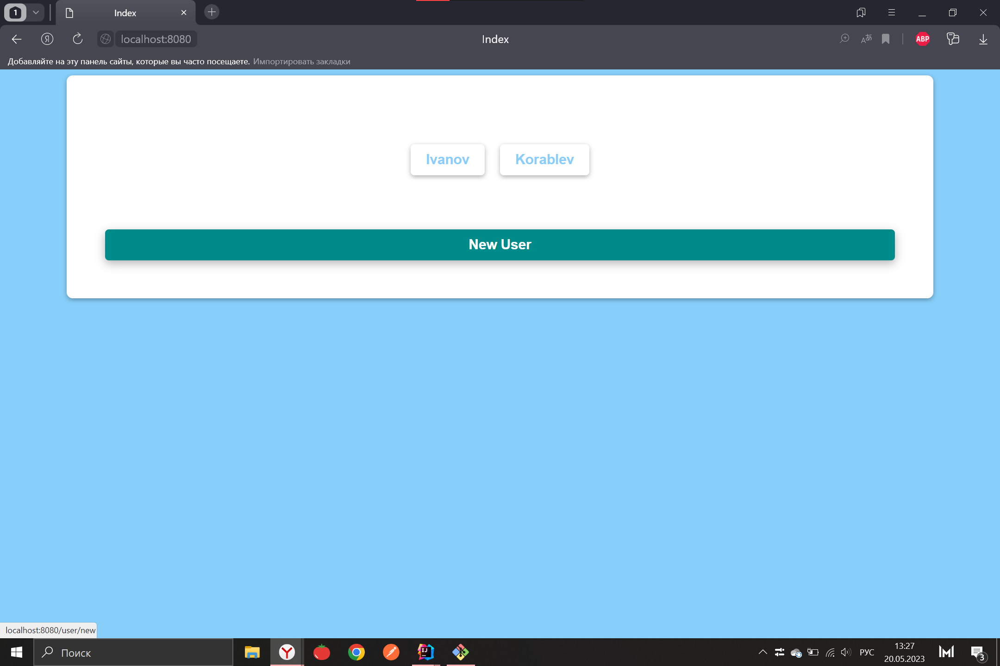
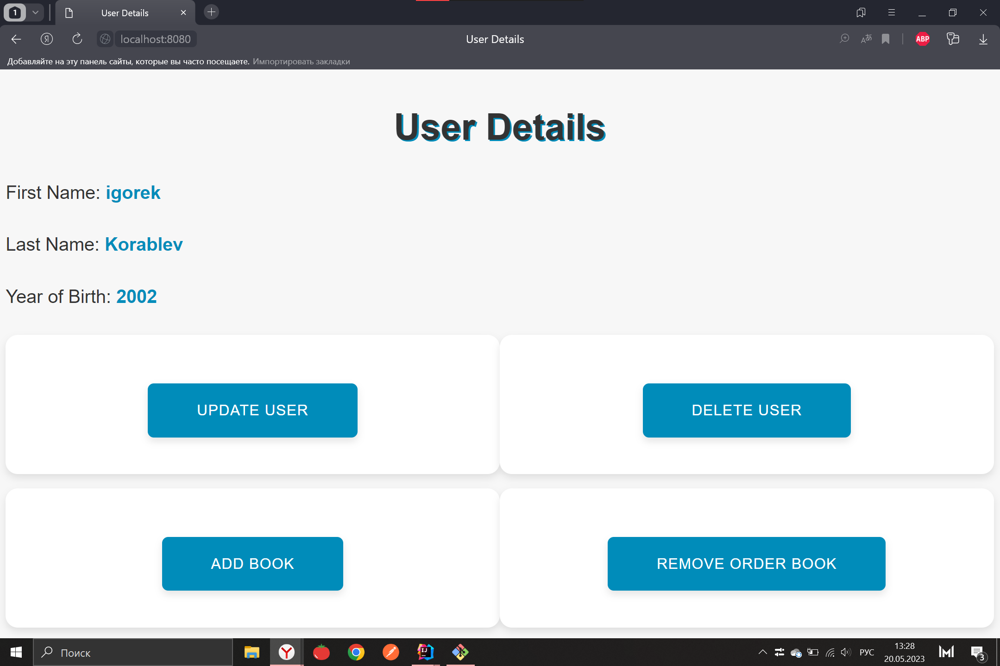
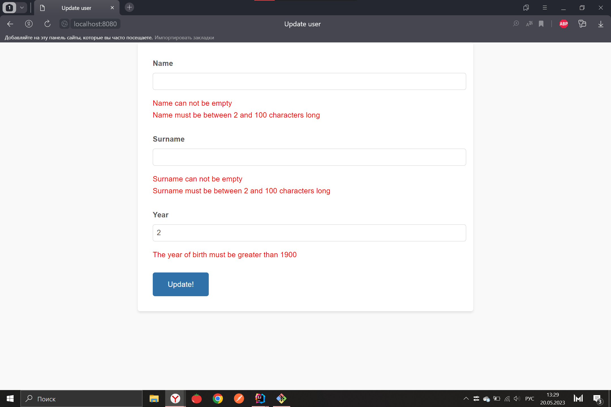
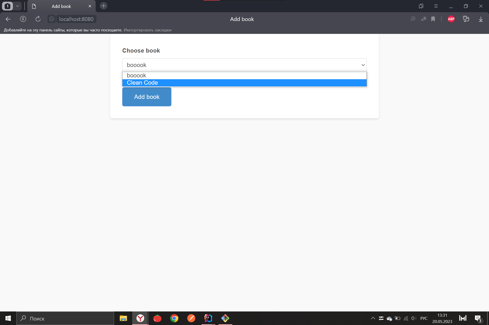

# Простейшее Spring MVC приложение с хранением данных в PostgreSQL для системы управления библиотекой

Это простое приложение позволяет управлять библиотекой с помощью веб-интерфейса. Вы можете добавлять, редактировать и удалять книги, авторов и другую информацию о библиотеке с помощью этого приложения.

Технологии, используемые в этом приложении:
- Spring MVC;
- PostgreSQL.

## Системные требования
- JDK 8 или выше;
- Apache Maven 3.6.3 или выше;
- PostgreSQL 9.5 или выше.

## Авторы
- `Игорек` - `korablev_sseu@mail.ru`

